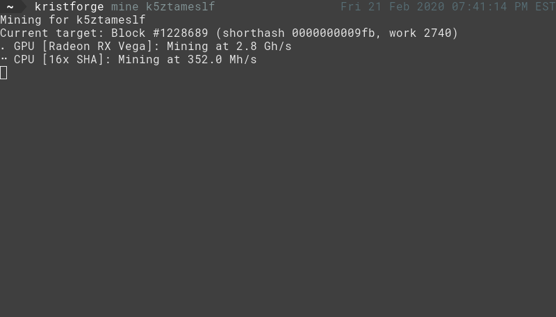

# kristforge 

Kristforge is a cross-platform hardware accelerated GPU and CPU [krist](https://krist.ceriat.net) miner. Kristforge uses
OpenCL and accelerated CPU instruction sets to maximize performance, making it the fastest krist miner in existence.

## Download

Pre-built 64-bit binaries for Linux and Windows can be found on the
[release page](https://github.com/tmpim/kristforge/releases). Unofficial packages are also available for Arch Linux in
the AUR ([kristforge-bin](https://aur.archlinux.org/packages/kristforge-bin/) or
[kristforge-git](https://aur.archlinux.org/packages/kristforge-git/)).

## Usage

Kristforge supports both CPU and GPU mining. GPU mining is usually faster and more efficient, but modern CPUs can also
provide decent speeds. OpenCL drivers are required for GPU support to work - these are usually included with your
graphics drivers, but you may need to manually install them. See your manufacturer's driver/support page for
instructions for your specific setup.

Kristforge provides many command-line options to configure it to suit your needs, but also intelligently selects 
defaults that provide near-optimal performance for most users. The default behavior of kristforge is to use all GPU
devices and automatically scale up batch sizes, and use as many CPU miner threads as your system has logical cores.

## Examples 

- Mine with default settings using both CPU and GPU
    - `kristforge mine <address>`
- Mine with default settings using only GPU
    - `kristforge mine <address> --no-cpu`
- Mine with only CPU with a specific number of threads
    - `kristforge mine <address> --no-gpu --cpu-threads 8`
- Get mining hardware information
    - `kristforge info`

Complete usage information for more advanced configuration can be viewed with `kristforge help [subcommand]`.
